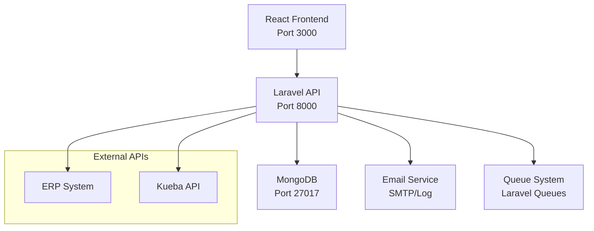

# 🏨 APDE - Advanced Prospect Data Engine

<div align="center">

[](https://laravel.com)
[](https://reactjs.org)
[](https://mongodb.com)
[](https://docker.com)

*A sophisticated campaign management system for Hotel Grand Pilatus*

</div>

---

## 🌟 Features

### 🎯 **Campaign Management**
- Create and manage email marketing campaigns
- Track campaign performance with detailed analytics
- Schedule and automate campaign delivery
- Real-time campaign status monitoring

### 📊 **Prospect Intelligence**
- Advanced prospect data import from multiple sources (ERP, Kueba)
- Intelligent prospect filtering and segmentation
- Comprehensive prospect analytics dashboard
- Data-driven prospect scoring and prioritization

### 🎨 **Landing Page Builder**
- Dynamic landing page creation and management
- Responsive design templates
- Performance tracking and optimization
- A/B testing capabilities

### 🔐 **Security & Authentication**
- JWT & Cookie-based API authentication
- Secure API endpoints with Laravel Sanctum
- CSRF protection and request validation

---

## 🚀 Quick Start

### Prerequisites

Before you begin, ensure you have the following installed:

- **Docker** & **Docker Compose** (recommended)
- **PHP 8.4+** (if running locally)
- **Node.js 24+** (if running locally)
- **Composer** (if running locally)

### 🐳 Docker Installation (Recommended)

1. **Clone the repository with submodules:**
   ```bash
   git clone git@github.com:chrisoco/APDE.git && cd apde
   git submodule update --init --recursive
   git submodule update --remote
   ```

2. **Environment Setup:**
   ```bash
   # Backend environment
   cp APDE_BE/.env.example APDE_BE/.env
   
   # Frontend environment
   cp APDE_FE/.env.example APDE_FE/.env

   # Ensure Entrypoints & start.sh are executable
   chmod +x entrypoints/*.sh
   chmod +x ./start.sh
   ```

3. **Configure Mail Settings:**
   
   Open `APDE_BE/.env` and update the mail configuration:
   
   **For Development (Log-based):**
   ```env
   MAIL_MAILER=log
   ```
   
   **For Testing (Mailtrap):**
   ```env
   MAIL_MAILER=smtp
   MAIL_HOST=sandbox.smtp.mailtrap.io
   MAIL_PORT=2525
   MAIL_USERNAME=your-mailtrap-username
   MAIL_PASSWORD=your-mailtrap-password
   ```

4. **Launch the application:**
   ```bash
   ./start.sh
   ```
   
   Or manually:
   ```bash
   docker compose up -d
   ```

5. **Access the application:**
   - 🌐 **Frontend:** http://localhost:3000
   - ⚡ **Backend API:** http://localhost:8000
   - 🍃 **MongoDB:** localhost:27017

---

## 🛠️ Local Development Setup

### Backend (Laravel)

```bash
cd APDE_BE

# Install dependencies
composer install

# Environment setup
cp .env.example .env

# Generate application key
php artisan key:generate

# Run migrations and seed database
php artisan migrate --seed

# Start development server
php artisan serve
```

### Frontend (React)

```bash
cd APDE_FE

# Install dependencies
npm ci

# Environment setup
cp .env.example .env

# Start development server
npm run dev
```

---

## 📋 Configuration Details

### 🔧 Backend Configuration (`APDE_BE/.env`)

| Variable | Description | Default |
|----------|-------------|---------|
| `APP_NAME` | Application name | CM-Grand-Pilatus |
| `APP_URL` | Backend API URL | http://localhost:8000 |
| `SPA_URL` | Frontend URL | http://localhost:5173 |
| `MONGODB_URI` | MongoDB connection | mongodb://localhost:27017 |
| `MONGODB_DATABASE` | Database name | apde |
| `MAIL_MAILER` | Mail driver | **smtp** ⚠️ *Configure this!* |
| `MAIL_FROM_ADDRESS` | From email | noreply@grand-pilatus.com |
| `APP_LOCALE` | Application locale | de_CH |

### ⚡ Frontend Configuration (`APDE_FE/.env`)

| Variable | Description | Default |
|----------|-------------|---------|
| `VITE_APP_ENV` | Environment | local |
| `VITE_API_URL` | Backend API URL | http://localhost:8000 |

---

## 📚 Mail Configuration Guide

### 🎯 **Development Environment**
Use log-based mailing for local development:
```env
MAIL_MAILER=log
```
*Emails will be logged to `storage/logs/laravel.log`*

### 🧪 **Testing Environment**
Use Mailtrap for email testing:
```env
MAIL_MAILER=smtp
MAIL_HOST=sandbox.smtp.mailtrap.io
MAIL_PORT=2525
MAIL_USERNAME=your-mailtrap-username
MAIL_PASSWORD=your-mailtrap-password
```

---

## 🏗️ Architecture Overview



### 🎨 **Frontend Stack**
- **React 18+** with TypeScript
- **Tailwind CSS 4** for styling
- **React Router** for navigation
- **Shadcn/UI** components

### ⚡ **Backend Stack**
- **Laravel 12** with PHP 8.4
- **MongoDB** with Laravel MongoDB package
- **Laravel Sanctum** for API authentication
- **Pest** for testing

---

## 🚢 Docker Services

| Service | Container | Port | Description |
|---------|-----------|------|-------------|
| **Frontend** | `apde_frontend` | 3000 | React application served with `serve` |
| **Backend** | `apde_backend` | 8000 | Laravel API with PHP-FPM |
| **Database** | `apde_mongo` | 27017 | MongoDB 8 with persistent storage |

### 📊 Volume Mounts
- **Backend:** `./APDE_BE:/var/www/html`
- **Frontend:** `./APDE_FE:/app`
- **MongoDB:** `mongo_data:/data/db` (persistent)
- **Entrypoints:** `./entrypoints:/apde-entrypoints:ro`

---

## 🧪 Testing

### Backend Tests
```bash
cd APDE_BE

# Run all tests
php artisan test

# Run specific test file
php artisan test tests/Feature/CampaignTest.php

# Run with coverage
php artisan test --coverage
```

### Code Quality
```bash
# Laravel Pint (Code formatting)
vendor/bin/pint

# PHPStan (Static analysis)
vendor/bin/phpstan analyse

# Rector (Code refactoring)
vendor/bin/rector
```

---

## 📖 API Documentation

- **OpenAPI Specification:** `APDE_BE/docs/openapi/openapi.yaml`
- **Postman Collection:** `APDE_BE/docs/APDE.postman_collection.json`
- **Interactive Docs:** http://localhost:8000/api/docs/openapi/ (when running)
